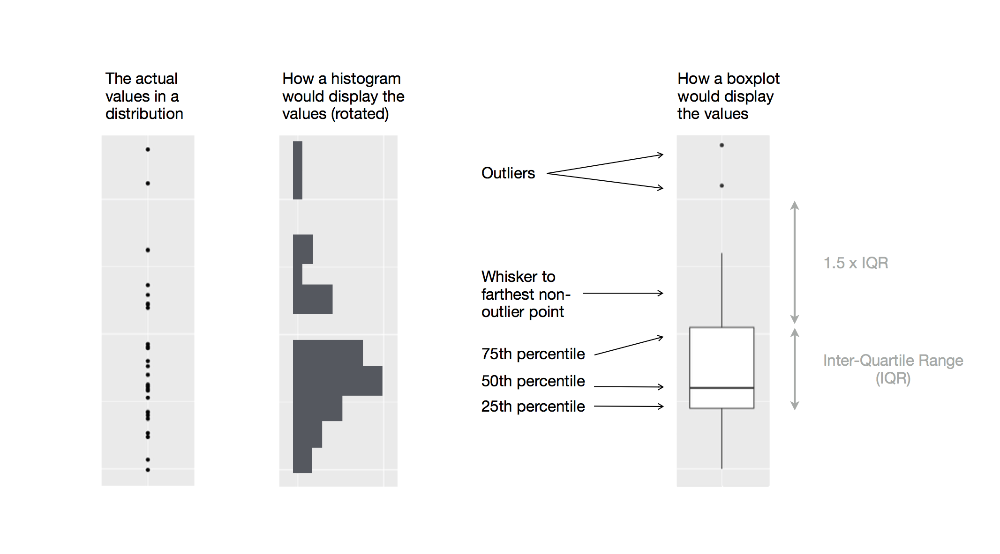

# 数据可视化 {#sec-data-visualization}

```{r}
#| echo: false
source("_common.R")
```

## 引言

> “简单的图形给数据分析师带来的信息比任何其它设备都多。” --- John Tukey

R 有几个用于绘图的系统，但 ggplot2 是最优雅和最通用的系统之一。ggplot2 实现了**图形语法 (grammar of graphics)**，这是一个用于描述和构建图形的连贯系统。你可以通过学习使用 ggplot2 这一个系统并将其应用于许多地方，从而更快地完成更多工作。

本章将告诉你如何使用 **ggplot2** 可视化你的数据。我们将从创建一个简单的散点图开始，并用它来介绍美学映射 (aesthetic mappings) 和几何对象 (geometric objects) —— 这些是 ggplot2 的基本模块。然后，我们将带你了解如何可视化单个变量的分布以及可视化两个或更多变量之间的关系。最后，我们将介绍保存图形和调试故障的技巧。

### 预备知识

本章重点介绍 ggplot2，它是 tidyverse 的核心包之一。要访问本章中使用的数据集、帮助页面和函数，请运行以下命令加载 tidyverse：

```{r}
#| label: setup
library(tidyverse)
```

这一行代码加载了 tidyverse 包，它们是你在几乎每次数据分析中都会用到的包。它还会告诉你 tidyverse 中的哪些函数与基础 R 中的函数（或你可能已加载的其它包中的函数）发生冲突[^data-visualize-1]。

[^data-visualize-1]: 你可以使用 conflicted 包来消除该消息并强制按需解决冲突，随着你加载更多包，这一点变得越来越重要。你可以在 <https://conflicted.r-lib.org> 了解更多关于 conflicted 包的信息。

如果你运行上面这行代码并收到错误消息 `there is no package called 'tidyverse'`，则需要先安装它，然后再次运行 `library()`。

```{r}
#| eval: false
install.packages("tidyverse")
library(tidyverse)
```

每个 R 包你只需要安装一次，但每次开始新的 R 会话时都需要先加载一次所需要的包。

除了 tidyverse，我们还将使用 **palmerpenguins** 包（它包含了 `penguins` 数据集，该数据集包含帕尔默群岛三个岛屿上企鹅的身体测量值），以及 ggthemes 包（它提供了一个色盲安全的调色板）。

```{r}
library(palmerpenguins)
library(ggthemes)
```

## 第一步

鳍状肢 (flipper) 较长的企鹅比鳍状肢较短的企鹅重还是轻？你可能已经有了答案，但现在试着让你的答案更精确一些：鳍状肢长度和体重之间的关系是什么样的？是正相关的吗？负相关的？线性的？非线性的？这种关系是否因企鹅的物种或者企鹅居住的岛屿而异？让我们创建一些可视化来回答这些问题。

### `penguins` 数据框

你可以使用 palmerpenguins 包中的 `penguins` **数据框** (data frame)（即 `palmerpenguins::penguins`）来测试你对这些问题的回答。数据框是变量（对应列）和观测（对应行）的矩形集合。`penguins` 包含由 Kristen Gorman 博士和南极洲帕尔默站 LTER 收集并提供的 `r nrow(penguins)` 个观测数据[^data-visualize-2]。

[^data-visualize-2]: Horst AM, Hill AP, Gorman KB (2020). palmerpenguins: Palmer Archipelago (Antarctica) penguin data. R package version 0.1.0. <https://allisonhorst.github.io/palmerpenguins/>. doi: 10.5281/zenodo.3960218.

为了便于讨论，我们定义一些术语：

-   **变量 (variable)** 是你可以测量的数量、质量或属性。

-   **值 (value)** 是当你测量变量时它的状态。变量的值可能会随着测量的不同而改变。

-   **观测 (observation)** 是在类似条件下进行的一组测量（如通常在同一时间对同一对象进行的一次观测中的所有测量）。一个观测将包含多个值，每个值与不同的变量相关联。我们有时将一个观测称为一个数据点（data point）。

-   **表格数据 (tabular data)** 是一组值，每个值都与一个变量和一个观测相关联。如果每个值都放在自己的“单元格”中，每个变量都有自己的列，每个观测都有自己的行，那么该表格数据就是*整洁的 (tidy)*。

在上面这个数据框例子中，某个变量指的是所有企鹅的某一个属性，而某个观测指的是某个企鹅的所有属性。

在控制台中输入数据框的名称，R 将打印其内容的预览。请注意，这里此预览顶部显示 `tibble`。在 tidyverse 中，我们使用称为 **tibbles** 的特殊数据框，你很快就会了解它的更多相关信息。

```{r}
penguins
```

此数据框包含 `r ncol(penguins)` 列。要查看可以看到每个变量前几个值的另一种视图，请使用 `glimpse()`。或者，如果你在 RStudio 中，运行 `View(penguins)` 以打开交互式数据查看器。

```{r}
glimpse(penguins)
```

`penguins` 中的变量包括：

1.  `species`：企鹅的物种（Adelie、Chinstrap、Gentoo）。

2.  `flipper_length_mm`：企鹅鳍状肢的长度，以毫米为单位。

3.  `body_mass_g`：企鹅的体重，以克为单位。

要了解有关 `penguins` 的更多信息，请运行 `?penguins` 打开其帮助页面。

### 最终目标 {#sec-ultimate-goal}

本章的最终目标是重新创建以下可视化，以展示这些企鹅的鳍状肢长度和体重之间的关系，并考虑企鹅物种的影响。

```{r}
#| echo: false
#| warning: false
#| fig-alt: |
#|   企鹅体重与鳍状肢长度的散点图，并叠加了这两个变量之间关系的最佳拟合线。该图显示这两个变量之间存在正相关、相当线性且相对较强相关的关系。物种（Adelie、Chinstrap 和 Gentoo）用不同的颜色和形状表示。这三个物种的体重和鳍状肢长度之间的关系大致相同，而 Gentoo 企鹅比其它两个物种的企鹅体型更大。
ggplot(penguins, aes(x = flipper_length_mm, y = body_mass_g)) +
  geom_point(aes(color = species, shape = species)) +
  geom_smooth(method = "lm") +
  labs(
    title = "Body mass and flipper length",
    subtitle = "Dimensions for Adelie, Chinstrap, and Gentoo Penguins",
    x = "Flipper length (mm)",
    y = "Body mass (g)",
    color = "Species",
    shape = "Species"
  ) +
  scale_color_colorblind()
```

### 绘制 ggplot 图

让我们一步一步地重新绘制这个图形。

对于 ggplot2，你需要从函数 `ggplot()` 开始绘图，先定义一个图形对象，然后向其添加**图层 (layers)**。`ggplot()` 的第一个参数是要在图形中使用的数据集，`ggplot(data = penguins)` 创建了一个空图以准备展示 `penguins` 数据，但由于我们还没有告诉它如何进行数据的可视化，所以目前它是空的。这不是一个非常令人兴奋的图形，但你可以把它想象成一块空白画布，你将在上面绘制图形的其余图层。

```{r}
#| fig-alt: |
#|   一个空白的灰色绘图区域。
ggplot(data = penguins)
```

接下来，我们需要告诉 `ggplot()` 如何直观地展示数据中的信息。`ggplot()` 函数的 `mapping` 参数定义了数据集中的变量如何映射到图形的视觉属性（**美学 (aesthetics)**）。`mapping` 参数总是在 `aes()` 函数中进行定义，`aes()` 的 `x` 和 `y` 参数指定要映射到 x 轴和 y 轴的变量。目前，我们将鳍状肢长度映射到 `x` 轴，将体重映射到 `y` 轴。ggplot2 在 `data` 参数中查找映射的变量，在本例中为 `penguins`。

下面的图形显示了添加这些映射的结果。

```{r}
#| fig-alt: |
#|   该图在 x 轴上显示鳍状肢长度，值的范围为 170 到 230，在 y 轴上显示体重，值的范围为 3000 到 6000。
ggplot(
  data = penguins,
  mapping = aes(x = flipper_length_mm, y = body_mass_g)
)
```

我们的空白画布现在有了更多的结构——可以很清楚地知道鳍状肢长度将显示在哪里（在 x 轴上）以及体重将显示在哪里（在 y 轴上）。但是企鹅自身信息还没有出现在图形上。这是因为我们还没有在代码中阐明如何在图形上表示数据框中的观测。

为此，我们需要定义一个 **geom**：即图形用来表示数据的几何对象（geometric object）。在 ggplot2 中，这些几何对象由以 `geom_` 开头的函数提供。我们通常通过图形使用的 geom 类型来描述图形。例如，条形图使用 bar geoms (`geom_bar()`)，线图使用 line geoms (`geom_line()`)，箱线图使用 boxplot geoms (`geom_boxplot()`)，散点图使用 point geoms (`geom_point()`)，依此类推。

函数 `geom_point()` 向图形添加一层散点的图层，从而创建一个散点图。ggplot2 附带了许多 geom 函数，每个函数都能向图形添加不同类型的图层。你将在整本书中学习大量的 geoms，特别是在 @sec-layers 中。

```{r}
#| fig-alt: |
#|   企鹅体重与鳍状肢长度的散点图。该图显示这两个变量之间存在正相关、相当线性且相对较强相关的关系。
ggplot(
  data = penguins,
  mapping = aes(x = flipper_length_mm, y = body_mass_g)
) +
  geom_point()
```

现在我们有了一个看起来像我们可能认为的“散点图”的图形。不过它还不符合上面我们的“最终目标”图形，但使用这张图，我们已经可以开始回答前面激发我们探索的那个问题：“鳍状肢长度和体重之间的关系是什么样的？”两者之间的关系似乎是正相关的（即，随着鳍状肢长度增加，体重也会增加）、相当线性的（点聚集在一条直线周围而不是在曲线周围），并且有中等相关强度（围绕这条直线的散点并不太多）；以及鳍状肢较长的企鹅通常体重较重。

在我们向这张图添加更多图层之前，让我们暂停片刻来检查一下我们上面收到的警告消息：

> Removed 2 rows containing missing values (`geom_point()`).

我们看到这个消息是因为我们的数据集中有两只企鹅缺少体重和/或鳍状肢长度值，由于它们存在缺失值，ggplot2 无法在图形上表示这两只企鹅的数据信息。像 R 一样，ggplot2 赞同**永远都不应该让缺失值悄无声息地缺失下去**的理念。这种类型的警告可能是你在处理真实数据时看到的最常见的警告类型之一——缺失值是一个非常常见的问题，你将通过整本书去了解更多关于它们的信息，特别是在 @sec-missing-values 中。对于本章中的其余图形，我们将暂时抑制此警告，以免它总与我们绘制的每个图形被一起打印出来。

### 添加美学属性和图层 {#sec-adding-aesthetics-layers}

散点图对于显示两个数值变量之间的关系很有用，但对两个变量之间表现出来的任何明显关系持怀疑态度，并询问是否有其它变量能够解释或改变这种关系，总是一个好的想法。例如，鳍状肢长度和体重之间的关系是否因物种而异？让我们将物种信息纳入进图形，看看这是否能产生一些关于这些变量之间明显关系的额外见解。我们将通过使用不同颜色的散点表示物种信息来做到这一点。

为了实现这一点，我们需要去修改美学属性还是 geom？如果你猜“在美学映射的 `aes()` 内部修改”，那么你已经掌握了使用 ggplot2 创建数据可视化的窍门！如果没猜中，也别担心。在整本书中，你将绘制更多的 ggplot 图，在绘制它们时你会有更多的机会来检验你的直觉。

```{r}
#| warning: false
#| fig-alt: |
#|   企鹅体重与鳍状肢长度的散点图。该图显示这两个变量之间存在正相关、相当线性且相对较强相关的关系。物种（Adelie、Chinstrap 和 Gentoo）用不同的颜色表示。
ggplot(
  data = penguins,
  mapping = aes(x = flipper_length_mm, y = body_mass_g, color = species)
) +
  geom_point()
```

当分类变量被映射到一个美学属性时，ggplot2 会自动为该分类变量的每个唯一水平（这里是三种物种中的每一种）分配一个唯一的美学属性值（这里是唯一颜色），这个过程称为**缩放 (scaling)**。ggplot2 还会添加一个图例（legend），以解释哪些美学属性值对应于哪些水平。

现在让我们再添加一个图层：拟合体重和鳍状肢长度之间关系的平滑曲线。在继续之前，请回顾上面的代码，并思考我们如何将其添加到现有的图形中。

由于这是表示我们数据的新几何对象，我们将添加一个新的 geom 作为 point geom 之上的图层：`geom_smooth()`。我们将使用 `method = "lm"` 指定我们要根据线性模型 (`l`inear `m`odel) 绘制最佳拟合线。

```{r}
#| warning: false
#| fig-alt: |
#|   企鹅体重与鳍状肢长度的散点图。散点图上叠加了三条平滑曲线，分别展示每个物种（Adelie、Chinstrap 和 Gentoo）这两个变量之间的关系。企鹅物种通过在散点和平滑曲线上使用不同的颜色表示。
ggplot(
  data = penguins,
  mapping = aes(x = flipper_length_mm, y = body_mass_g, color = species)
) +
  geom_point() +
  geom_smooth(method = "lm")
```

我们已成功添加了拟合线，但这张图看起来不像 @sec-ultimate-goal 中的图形，那张图中整个数据集只有一条拟合线，而不是每个企鹅物种都有单独的拟合线。

当美学映射在 `ggplot()` 中被定义时，即表示它处于在*全局（global）*级别，全局级别的美学映射会传递给图形的每一个后续 geom 图层。与此同时，ggplot2 中每个 geom 函数也可以接受各自的 `mapping` 参数，这允许它们在*局部（local）*级别进行美学映射，这些局部级别映射会被添加到后续仍然只继承全局级别映射的图形中。由于我们希望散点根据物种着色，但不希望为每个物种绘制各自的拟合线，因而我们应该只为 `geom_point()` 指定 `color = species`。

```{r}
#| warning: false
#| fig-alt: |
#|   企鹅体重与鳍状肢长度的散点图。散点图上叠加了一条最佳拟合线，以展示三个物种中这两个变量之间的关系。不同的企鹅物种（Adelie、Chinstrap 和 Gentoo）仅通过在散点上使用不同的颜色表示。
ggplot(
  data = penguins,
  mapping = aes(x = flipper_length_mm, y = body_mass_g)
) +
  geom_point(mapping = aes(color = species)) +
  geom_smooth(method = "lm")
```

瞧！我们得到了一张看起来非常像我们最终目标的图，虽然它还不完美。我们仍然需要为每种企鹅使用不同的形状并改进它们的标签（labels）。

我们通常不建议在图形上仅仅使用颜色来区分表示信息，因为由于色盲或其它色觉差异，人们对颜色的感知不同。因此，除了颜色之外，我们还可以将 `species` 映射到 `shape` 美学属性。

```{r}
#| warning: false
#| fig-alt: |
#|   企鹅体重与鳍状肢长度的散点图。散点图上叠加了一条最佳拟合线，以展示三个物种中这两个变量之间的关系。不同的企鹅物种（Adelie、Chinstrap 和 Gentoo）仅通过在散点上使用不同的颜色和形状进行表示。
ggplot(
  data = penguins,
  mapping = aes(x = flipper_length_mm, y = body_mass_g)
) +
  geom_point(mapping = aes(color = species, shape = species)) +
  geom_smooth(method = "lm")
```

请注意，图例也会自动更新以反映散点的不同形状。

最后，我们可以使用新图层中的 `labs()` 函数改进图形的标签。`labs()` 的一些参数可能是不言自明的：比如，`title` 添加标题，`subtitle` 添加副标题。其它参数仍然与美学映射相匹配，`x` 是 x 轴标签，`y` 是 y 轴标签，`color` 和 `shape` 则定义图例的标签。此外，我们可以使用 ggthemes 包中的 `scale_color_colorblind()` 函数将调色板改进为色盲安全型。

```{r}
#| warning: false
#| fig-alt: |
#|   企鹅体重与鳍状肢长度的散点图，并叠加了一条显示这两个变量之间关系的最佳拟合线。该图显示这两个变量之间存在正相关、相当线性且相对较强相关的关系。物种（Adelie、Chinstrap 和 Gentoo）用不同的颜色和形状表示。这三个物种的体重和鳍状肢长度之间的关系大致相同，而 Gentoo 企鹅比其它两个物种的企鹅体型更大。
ggplot(
  data = penguins,
  mapping = aes(x = flipper_length_mm, y = body_mass_g)
) +
  geom_point(aes(color = species, shape = species)) +
  geom_smooth(method = "lm") +
  labs(
    title = "Body mass and flipper length",
    subtitle = "Dimensions for Adelie, Chinstrap, and Gentoo Penguins",
    x = "Flipper length (mm)", y = "Body mass (g)",
    color = "Species", shape = "Species"
  ) +
  scale_color_colorblind()
```

我们终于有了一张与我们的“最终目标”完美匹配的图！

### 练习

1.  `penguins` 中有多少行？有多少列？

2.  `penguins` 数据框中的 `bill_depth_mm` 变量描述了什么？阅读 `?penguins` 的帮助以找出答案。

3.  绘制 `bill_depth_mm` 与 `bill_length_mm` 的散点图。也就是说，绘制一个 y 轴为 `bill_depth_mm`，x 轴为 `bill_length_mm` 的散点图。描述这两个变量之间的关系。

4.  如果你绘制 `species` 与 `bill_depth_mm` 的散点图会发生什么？什么 geom 可能是更好的选择？

5.  为什么以下代码会报错，你会如何修复它？

    ```{r}
    #| eval: false
    ggplot(data = penguins) + 
      geom_point()
    ```

6.  `geom_point()` 中的 `na.rm` 参数是做什么的？该参数的默认值是什么？绘制一个散点图，在其中成功使用此参数并设置为 `TRUE`。

7.  向你在上一个练习中绘制的图形添加以下标题：“Data come from the palmerpenguins package.” 提示：查看 `labs()` 的文档。

8.  重新创建以下可视化。`bill_depth_mm` 应该映射到什么美学属性？它应该是在全局级别还是在 geom 级别进行映射？

    ```{r}
    #| echo: false
    #| warning: false
    #| fig-alt: |
    #|   企鹅体重与鳍状肢长度的散点图，并根据喙深度着色。散点图上叠加了一条展示体重和鳍状肢长度之间关系的平滑曲线。这两个变量之间存在正相关、相当线性且中等相关强度的关系。
    ggplot(
      data = penguins,
      mapping = aes(x = flipper_length_mm, y = body_mass_g)
    ) +
      geom_point(aes(color = bill_depth_mm)) +
      geom_smooth()
    ```

9.  在脑海中预测此代码输出会是什么样子。然后，在 R 中运行代码并检查你的预测。

    ```{r}
    #| eval: false
    ggplot(
      data = penguins,
      mapping = aes(x = flipper_length_mm, y = body_mass_g, color = island)
    ) +
      geom_point() +
      geom_smooth(se = FALSE)
    ```

10. 这两个图形看起来会不同吗？为什么/为什么不？

    ```{r}
    #| eval: false
    ggplot(
      data = penguins,
      mapping = aes(x = flipper_length_mm, y = body_mass_g)
    ) +
      geom_point() +
      geom_smooth()

    ggplot() +
      geom_point(
        data = penguins,
        mapping = aes(x = flipper_length_mm, y = body_mass_g)
      ) +
      geom_smooth(
        data = penguins,
        mapping = aes(x = flipper_length_mm, y = body_mass_g)
      )
    ```

## ggplot2 调用 {#sec-ggplot2-calls}

随着我们继续深入，我们将过渡到学习更简洁的 ggplot2 代码表达方式。到目前为止，我们一直显式地提供这些参数，这在你刚开始学习时会很有帮助：

```{r}
#| eval: false
ggplot(
  data = penguins,
  mapping = aes(x = flipper_length_mm, y = body_mass_g)
) +
  geom_point()
```

通常，函数的前一两个参数非常重要，你应该把它们牢记在心。`ggplot()` 的前两个参数是 `data` 和 `mapping`，在本书的其余部分，我们将不再提供这些参数名。这节省了打字时间，并且通过减少额外文本量，我们更容易看出图形之间的差异。这是一个非常重要的编程问题，我们会在 @sec-functions 中回过头来讨论。

更简洁地重写前面的图形代码：

```{r}
#| eval: false
ggplot(penguins, aes(x = flipper_length_mm, y = body_mass_g)) + 
  geom_point()
```

将来，你还将了解管道 `|>`，它允许你使用以下代码创建该图形：

```{r}
#| eval: false
penguins |> 
  ggplot(aes(x = flipper_length_mm, y = body_mass_g)) + 
  geom_point()
```

## 可视化分布

如何可视化变量的分布取决于变量的类型：是分类变量还是数值变量。

### 分类变量

如果一个变量只能取一小组值中的一个，那么它就是**分类变量 (categorical variable)**。要检查分类变量的分布，你可以使用条形图。每个条形的高度显示每个 `x` 值出现的观测数。

```{r}
#| fig-alt: |
#|   企鹅物种频数的条形图：Adelie（约 150 只）、Chinstrap（约 90 只）、Gentoo（约 125 只）。
ggplot(penguins, aes(x = species)) +
  geom_bar()
```

在具有无序水平的分类变量的条形图中，如上面 `species`，通常最好根据频数重新排序条形图。这样做需要将变量转换为因子（R 处理分类变量的方式），然后重新排序该因子的水平。

```{r}
#| fig-alt: |
#|   企鹅物种频数的条形图，其中条形按高度（即频数）降序排列：Adelie（约 150 只）、Gentoo（约 125 只）、Chinstrap（约 90 只）。
ggplot(penguins, aes(x = fct_infreq(species))) +
  geom_bar()
```

你将在 @sec-factors 中了解更多关于因子和处理因子的函数（如上面显示的 `fct_infreq()`）的信息。

### 数值变量

如果一个变量可以取广泛的数值，并且对这些值进行加、减或取平均值是有意义的，那么它就是**数值变量 (numerical variable)**（或定量变量）。数值变量可以是连续的或者离散的。

一种常用的对连续变量分布进行可视化的方法是直方图（histogram）。

```{r}
#| warning: false
#| fig-alt: |
#|   企鹅体重的直方图。分布是单峰的且右偏，范围大约在 2500 到 6500 克之间。
ggplot(penguins, aes(x = body_mass_g)) +
  geom_histogram(binwidth = 200)
```

直方图将 x 轴划分为等间距的箱 (bins)，然后使用条形的高度表示落入每个箱中的观测数量。在上面的图中，最高的条形显示有 39 个观测的 `body_mass_g` 值在 3,500 到 3,700 克之间，这两个数值分别是条形的左边缘和右边缘。

你可以使用 binwidth 参数来设置直方图中箱的区间宽度，该参数的单位对应 `x` 变量的单位。在处理直方图时，你应该始终探索各种 binwidth，因为不同的 binwidth 可以揭示不同的模式。在下图中，20 的 binwidth 太窄，导致条形太多，难以确定分布的形状。同样，2,000 的 binwidth 太宽，导致所有数据仅被分入三个条形中，也难以确定分布的形状。200 的 binwidth 提供了一个合理的平衡。

```{r}
#| warning: false
#| layout-ncol: 2
#| fig-width: 3
#| fig-alt: |
#|   两张企鹅体重的直方图，一张的组距（binwidth）为 20（左），另一张的组距为 2000（右）。组距为 20 的直方图显示条形高度有许多起伏，形成了锯齿状的轮廓。组距为 2000 的直方图则只显示了三个条形。
ggplot(penguins, aes(x = body_mass_g)) +
  geom_histogram(binwidth = 20)
ggplot(penguins, aes(x = body_mass_g)) +
  geom_histogram(binwidth = 2000)
```

数值变量分布的另一种可视化方法是密度图（density plot）。密度图是直方图的平滑版，也是一种实用的替代方案，特别是对于来自潜在平滑分布的连续数据。这里我们不会深入探讨 `geom_density()` 如何估计密度（你可以在函数文档中阅读更多相关信息），但让我们用一个类比来解释密度曲线是如何绘制的。想象一个由木块制成的直方图。然后，想象你在上面扔一根煮熟的意大利面条。面条覆盖在木块上的形状可以被认为是密度曲线的形状。它显示的细节比直方图少，但可以更容易地快速收集分布的形状，特别是关于众数和偏度。

```{r}
#| fig-alt: |
#|   企鹅体重的密度图。分布是单峰的且右偏，范围大约在 2500 到 6500 克之间。
ggplot(penguins, aes(x = body_mass_g)) +
  geom_density()
```

### 练习

1.  绘制 `penguins` 的 `species` 条形图，其中将 `species` 分配给 `y` 美学属性。这个图形有什么不同？

2.  以下两个图形有何不同？哪个美学属性，`color` 还是 `fill`，对改变条形的颜色更有用？

    ```{r}
    #| eval: false
    ggplot(penguins, aes(x = species)) +
      geom_bar(color = "red")

    ggplot(penguins, aes(x = species)) +
      geom_bar(fill = "red")
    ```

3.  `geom_histogram()` 中的 `bins` 参数是做什么的？

4.  绘制加载 tidyverse 包时可用的 `diamonds` 数据集中 `carat` 变量的直方图。尝试不同的 binwidth。什么 binwidth 揭示了最有趣的模式？

## 可视化关系

要可视化关系，我们需要至少将两个变量映射到图形的美学属性中。在接下来的部分中，你将了解用于可视化两个或更多变量之间关系的常用图形以及用于创建它们的 geoms。

### 一个数值变量和一个分类变量

要可视化数值变量和分类变量之间的关系，我们可以使用并排箱线图。**箱线图 (boxplot)** 是一种用于描述分布的位置度量（百分位数）的视觉速记。它对于识别潜在的异常值也很有用。如 @fig-eda-boxplot 所示，每个箱线图包括：

-   一个指示处于数据中间一半的范围的箱子，称为四分位间距 (interquartile range, IQR) ，从分布的第 25 百分位数（the 25th percentile）延伸到第 75 百分位数（the 75th percentile）。箱子中间是一条显示分布中位数（即第 50 百分位数，the 50th percentile） 的直线。这三条线让你能够了解分布的扩散情况，以及分布是否关于中位数对称或向一侧呈偏态分布。

-   表示落在箱子边缘任一侧超过 1.5 倍 IQR 的观测的散点。这些异常点是不寻常的，因此单独绘制出来。

-   一条从箱子的每一端延伸到分布中最远非异常点的线（或须）。

```{r}
#| label: fig-eda-boxplot
#| echo: false
#| fig-cap: |
#|   描述箱线图如何创建的图示。
#| fig-alt: |
#|   一张描述如何按照上述步骤创建箱线图的示意图。

```

让我们使用 `geom_boxplot()` 查看按物种划分的体重分布：

```{r}
#| warning: false
#| fig-alt: |
#|   Adelie、Chinstrap 和 Gentoo 企鹅体重分布的并排箱线图。Adelie 和 Chinstrap 企鹅的体重分布似乎是对称的，中位数在 3750 克左右。Gentoo 企鹅的体重中位数要高得多，约为 5000 克，并且这些企鹅的体重分布似乎有些右偏。
ggplot(penguins, aes(x = species, y = body_mass_g)) +
  geom_boxplot()
```

或者，我们可以使用 `geom_density()` 绘制密度图。

```{r}
#| warning: false
#| fig-alt: |
#|   按企鹅物种划分的企鹅体重密度图。每个物种（Adelie、Chinstrap 和 Gentoo）的密度曲线轮廓用不同的颜色表示。
ggplot(penguins, aes(x = body_mass_g, color = species)) +
  geom_density(linewidth = 0.75)
```

这里我们还使用了 `linewidth` 参数自定义线条的粗细，以使它们在背景中更加突出。

此外，我们可以将 `species` 映射到 `color` 和 `fill` 美学属性，并使用 `alpha` 美学属性为填充颜色后的密度曲线添加透明度。`alpha` 取值在 0（完全透明）和 1（完全不透明）之间。在下面的图形中，它被*设置（set）*为 0.5。

```{r}
#| warning: false
#| fig-alt: |
#|   按企鹅物种划分的企鹅体重密度图。每个物种（Adelie、Chinstrap 和 Gentoo）的密度曲线轮廓用不同的颜色表示，且填充相同的颜色，并增加透明度设置。
ggplot(penguins, aes(x = body_mass_g, color = species, fill = species)) +
  geom_density(alpha = 0.5)
```

请注意我们在这里使用的术语：

-   如果我们希望某个美学属性根据某变量的值而变化，我们表达为：将某个变量*映射（map）*到某个美学属性上。
-   否则，我们表达为：*设置（set）*某个美学属性的值。

### 两个分类变量

我们可以使用堆叠条形图来可视化两个分类变量之间的关系。例如，以下两个堆叠条形图都展示了 `island` 和 `species` 之间的关系，或者更具体地说，可视化每个岛屿内 `species` 的分布。

第一张图展示了每个岛屿上每种企鹅的频数。频数图显示每个岛屿上的 Adelie 企鹅数量相等。但我们对每个岛屿内物种的百分比分布没有很好的认识。

```{r}
#| fig-alt: |
#|   按岛屿（Biscoe、Dream 和 Torgersen）划分的企鹅物种条形图。
ggplot(penguins, aes(x = island, fill = species)) +
  geom_bar()
```

第二张图通过在 geom 中设置 `position = "fill"` 创建相对频数图，这对于比较跨岛屿的物种分布更有用，因为它不受不同岛屿企鹅总数不相等的影响。通过这张图，我们可以看到 Gentoo 企鹅都生活在 Biscoe 岛上，约占该岛企鹅的 75%，Chinstrap 都生活在 Dream 岛上，约占该岛企鹅的 50%，而 Adelie 生活在所有三个岛屿上，且 Torgersen 岛上只有 Adelie 企鹅。

```{r}
#| fig-alt: |
#|   按岛屿（Biscoe、Dream 和 Torgersen）划分的企鹅物种条形图。全部条形被缩放到相同的高度，使其成为相对频数图。y 轴默认标记为 "count"。
ggplot(penguins, aes(x = island, fill = species)) +
  geom_bar(position = "fill")
```

在创建这些条形图时，我们将要分隔成条形的变量映射到 `x` 美学属性，将改变条形内部颜色的变量映射到 `fill` 美学属性。不幸的是，ggplot2 默认将 y 轴标记为 `"count"`，但我们可以通过添加 `labs()` 图层来覆盖它，我们在其中将 y 轴标签指定为 `"proportion"`。

```{r}
#| fig-alt: |
#|   按岛屿（Biscoe、Dream 和 Torgersen）划分的企鹅物种条形图。全部条形被缩放到相同的高度，使其成为相对频数图。y 轴标记为 "proportion"。
ggplot(penguins, aes(x = island, fill = species)) +
  geom_bar(position = "fill") +
  labs(y = "proportion")
``` 

### 两个数值变量

到目前为止，你已经了解了用于可视化两个数值变量之间关系的散点图（使用 `geom_point()` 创建）和平滑曲线（使用 `geom_smooth()` 创建）。散点图可能是用于可视化两个数值变量之间关系的最常用图形。

```{r}
#| warning: false
#| fig-alt: |
#|   企鹅体重与鳍状肢长度的散点图。该图显示这两个变量之间存在正相关、相当线性且相对较强相关的关系。
ggplot(penguins, aes(x = flipper_length_mm, y = body_mass_g)) +
  geom_point()
```

### 三个或更多变量

正如我们在 @sec-adding-aesthetics-layers 中看到的，我们可以通过将更多变量映射到其它美学属性来将它们的信息纳入图形之中。例如，在下面的散点图中，散点的颜色表示物种，散点的形状表示岛屿。

```{r}
#| warning: false
#| fig-alt: |
#|   企鹅体重与鳍状肢长度的散点图。该图显示这两个变量之间存在正相关、相当线性且相对较强相关的关系。散点的颜色基于企鹅的物种，散点的形状代表岛屿（圆点是 Biscoe 岛，三角形是 Dream 岛，正方形是 Torgersen 岛）。该图非常杂乱，很难区分点的形状。
ggplot(penguins, aes(x = flipper_length_mm, y = body_mass_g)) +
  geom_point(aes(color = species, shape = island))
```

然而，向一张图添加过多的美学映射会使其变得杂乱无章，难以理解。另一种解决办法，特别是对于分类变量，是将图拆分为**分面 (facets)**，即每个子图各自显示数据的一个子集。

要按单个变量对图形进行分面，请使用 `facet_wrap()`。`facet_wrap()` 的第一个参数是一个公式（formula）[^data-visualize-3]，用 `~` 后跟一个变量名来创建它。你传递给 `facet_wrap()` 的变量应该是分类变量。

[^data-visualize-3]: 这里的“公式（formula）”是由 `~` 创建的事物的名称，而不是“方程（equation）”的同义词。

```{r}
#| warning: false
#| fig-width: 8
#| fig-asp: 0.33
#| fig-alt: |
#|   企鹅体重与鳍状肢长度的散点图。散点的形状和颜色代表物种。来自每个岛屿的企鹅都在单独的分面中。在每个分面内，体重和鳍状肢长度之间的关系是正相关、相当线性且相对较强相关的。
ggplot(penguins, aes(x = flipper_length_mm, y = body_mass_g)) +
  geom_point(aes(color = species, shape = species)) +
  facet_wrap(~island)
```

你将在 @sec-layers 中了解许多其它用于可视化变量分布及其之间关系的 geoms。

### 练习

1.  ggplot2 包中的 `mpg` 数据框包含美国环境保护署收集的关于 `r mpg |> distinct(model) |> nrow()` 种车型的 `r nrow(mpg)` 个观测。`mpg` 中的哪些变量是分类变量？哪些变量是数值变量？（提示：输入 `?mpg` 阅读数据集的文档。）运行 `mpg` 时如何查看此信息？

2.  使用 `mpg` 数据框绘制 `hwy` 与 `displ` 的散点图。接下来，将第三个数值变量映射到 `color`，然后是 `size`，然后是同时 `color` 和 `size`，再然后是 `shape`。这些美学属性对于分类变量与数值变量的表现有何不同？

3.  在 `hwy` 与 `displ` 的散点图中，如果将第三个变量映射到 `linewidth` 会发生什么？

4.  如果将同一个变量映射到多个美学属性，会发生什么？

5.  绘制 `bill_depth_mm` 与 `bill_length_mm` 的散点图，并按 `species` 为散点着色。添加按物种着色揭示了关于这两个变量之间关系的什么信息？按 `species` 分面呢？

6.  为什么以下代码会产生两个单独的图例？你会如何修复它以合并这两个图例？

    ```{r}
    #| warning: false
    #| fig-show: hide
    ggplot(
      data = penguins,
      mapping = aes(
        x = bill_length_mm, y = bill_depth_mm, 
        color = species, shape = species
      )
    ) +
      geom_point() +
      labs(color = "Species")
    ```

7.  创建以下两个堆叠条形图。你可以用第一个图形回答哪个问题？你可以用第二个图形回答哪个问题？

    ```{r}
    #| fig-show: hide
    ggplot(penguins, aes(x = island, fill = species)) +
      geom_bar(position = "fill")
    ggplot(penguins, aes(x = species, fill = island)) +
      geom_bar(position = "fill")
    ```

## 保存图形 {#sec-ggsave}

绘制好图形后，你可能希望将其从 R 中导出，并保存为可以在任何其它地方使用的图像。这就是 `ggsave()` 的工作，它会把最近创建的图形保存到磁盘：

```{r}
#| fig-show: hide
#| warning: false
ggplot(penguins, aes(x = flipper_length_mm, y = body_mass_g)) +
  geom_point()
ggsave(filename = "penguin-plot.png")
```

```{r}
#| include: false
file.remove("penguin-plot.png")
```

这将把你的图形保存到你的工作目录（working directory），你将在 @sec-workflow-scripts-projects 中了解更多关于这个概念的信息。

如果你不指定 `width` 和 `height`，它们的数值将取自当前绘图设备。为了代码的可重复性，你应该指定它们。你可以在 `ggsave()` 文档中了解更多相关信息。

然而，通常我们建议你使用 Quarto 组装你的最终数据分析报告。Quarto 是一个可重复的创作系统，允许你交织代码和文字，并自动将图形包含在你的文章中。你将在 @sec-quarto 中了解更多关于 Quarto 的信息。

### 练习

1.  运行以下代码。哪两个图形被保存为 `mpg-plot.png`？为什么？

    ```{r}
    #| eval: false
    ggplot(mpg, aes(x = class)) +
      geom_bar()
    ggplot(mpg, aes(x = cty, y = hwy)) +
      geom_point()
    ggsave("mpg-plot.png")
    ```

2.  你需要更改上面代码中的什么才能将图形保存为 PDF 而不是 PNG？你如何找出 `ggsave()` 支持哪些类型的图像文件？

## 常见问题

当你开始运行 R 代码时，你很可能会遇到问题。别担心——每个人都会遇到这种情况。我们都已经写了很多年 R 代码了，但每天我们仍然会写出第一次无法正常运行的代码！

在你跟随本书学习时，你应当首先仔细比对你运行的代码和本书中的代码。R 非常挑剔，一个放错位置的字符可能会造成巨大的差异。确保每个 `(` 都与一个 `)` 匹配，每个 `"` 都与另一个 `"` 配对。有时你运行完代码却什么也没发生，可以去检查控制台的左侧：如果显示 `+`, 这意味着 R 认为你没有输入完整的表达式，它仍然在等待你完整输入。在这种情况下，通过按 ESCAPE 通常可以很容易地中止处理当前命令并从头开始。

创建 ggplot2 图时的一个常见问题是将 `+` 放在了错误的位置：它必须位于代码行尾，而不是行首。换句话说，确保你没有意外地写出这样的代码：

```{r}
#| eval: false
ggplot(data = mpg) 
+ geom_point(mapping = aes(x = displ, y = hwy))
```

如果你仍然卡住，试试查看帮助页面。你可以通过在控制台中运行 `?function_name` 或者在 RStudio 中选中函数名称并按 F1 来获取有关任何 R 函数的帮助。如果帮助页面看起来没什么帮助也不要担心——相反，可以跳到其示例部分并查找与你尝试做的事情相匹配的代码。

如果这也没有帮助，请仔细阅读错误消息。有时答案就藏在那里！但是当你刚接触 R 时，即使答案在错误消息中，你或许并不知道如何理解它。另一个很棒的工具是 Google：尝试 Google 搜索错误消息，因为很可能其它人也遇到过同样的问题，并在网上得到了帮助。

## 总结

在本章中，你学习了使用 ggplot2 进行数据可视化的基础知识。我们从支撑 ggplot2 的基本思想开始：可视化是将数据中变量映射到图形的位置、颜色、大小和形状等美学属性。然后，你学习了如何逐层增加图形的复杂度并改进其呈现方式。你还学习了用于可视化单个变量分布以及两个或更多变量之间关系的常用图形，绘制方法是利用额外的美学映射和/或使用分面将图形拆分为多个小图。

我们将在本书中反复使用可视化，会在 @sec-layers 到 @sec-communication 中更深入地探讨使用 ggplot2 创建可视化，并在需要时引入新技术。

掌握了可视化的基础知识后，在下一章中，我们将稍微转换一下思路，给你一些实用的工作流程建议。我们之所以选择在本书的这一部分中穿插工作流程的内容，是因为在你编写越来越多的 R 代码时它将有助于你保持项目条理、逻辑清楚。
